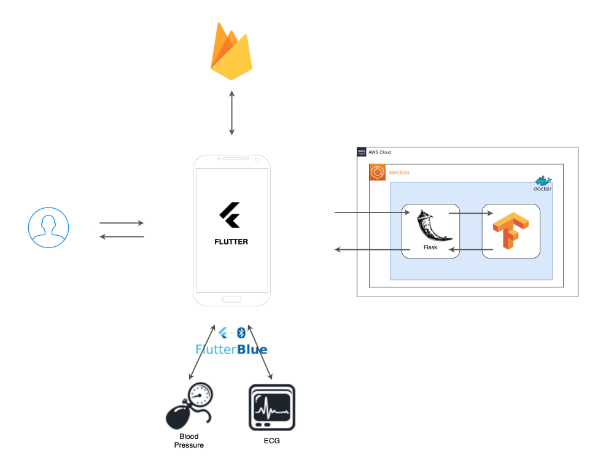
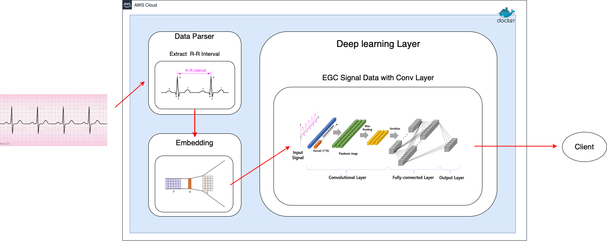

# goh(Guardian Of your Heart)

A new Flutter project.

## App Design Template from
[Medical App Freebies!](https://dribbble.com/shots/11196293-Medical-App-Freebies)

## Getting Started

This project is a starting point for a Flutter application.

A few resources to get you started if this is your first Flutter project:

- [Lab: Write your first Flutter app](https://docs.flutter.dev/get-started/codelab)
- [Cookbook: Useful Flutter samples](https://docs.flutter.dev/cookbook)

For help getting started with Flutter development, view the
[online documentation](https://docs.flutter.dev/), which offers tutorials,
samples, guidance on mobile development, and a full API reference.

## Server Architecture
/app_architecture.png)

## ECG Model Architecture
/flutter아키텍처/ECG_model_architecture.drawio-2.png)

## demo video
<figure class="video_container">
  <video controls="true" allowfullscreen="true">
    <source src="./proj_docs(goh_flutter)/goh_simulation.mp4" type="video/mp4">
  </video>
</figure>